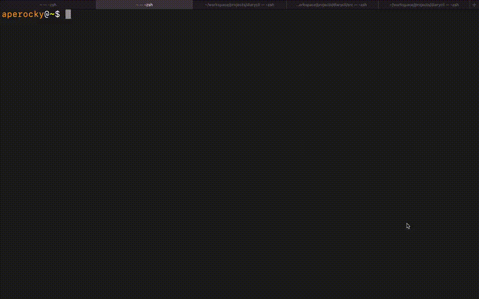

## DiaryCLI

`$ pip install diarycli`

One CLI command to create and organize your diaries in the terminal.

`$ diary` opens a CLI editor to today's diary (path: `$DIARY_DIR/year/month/date.md`)

`$ diary cat` cat the content of today's diary to terminal.

`$ diary 2020-01-01` create a diary entry for 2020/01/01 in the appropriate file path.

Use environment argument `DIARY_DIR` and `DIARY_EDITOR` to configure where the diary are and what editor to use, by default, it use `vim` as editor and `~/diary` as path for diary.

When installing via `pip`, if you see following message:

```
WARNING: The script diary is installed in '/some/path/examples/bin' which is not on PATH
Consider adding this directory to PATH or, if you prefer to suppress this warning, use --no-warn-script-location
```

You may want to add this location to `PATH`, to do that, add the following line to your `.rc` file:

```
export PATH=$PATH:/some/path/examples/bin
```

### Demo



### Inspiration

Inspiration from bash diary script that I have created and used for years: https://github.com/Aperocky/diaryman/blob/master/diaryman.sh

`pip` provides an easier way to package and distribute this software.

